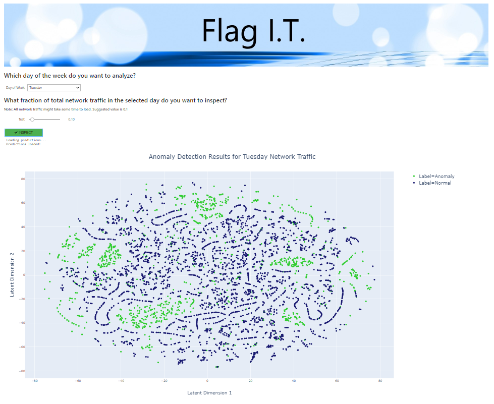

## Problem

Computer networks are constantly subjected to attacks which can effectively cripple a business' ability to function. Cyber attacks are hard to detect but are also costly to miss. The average cost of a single cyber attack on an enterprise network was estimated to be $1.3M in 2017.

#Dataset and Methodology

This project uses anomaly detection, in particular novelty detection, to alert network administrators and security experts when a network is potentially under attack. The dataset used is the Canadian Institute of Cybersecurity Intrusion Detection Evaluation Dataset (CICID S2017).

The dataset represents 3 days worth of network traffic activity, 2 days of which included the following cyber attacks: Brute Force, Denial of Service (DoS), Distributed Denial of Service (DDoS).

## Front End

The project has a working webapp that can be used as a dashboard to visualize anomalies in the network traffic.

For working webapp is named "dashboard.ipynb" under ./webapp directory. See ./notebooks/8-Novelty Detection for a detailed notebook explaining the code in the webapp (excluding training procedure).

The webapp by default uses the saved predictions to visualize. You can also predict on a dataset of your choosing but models files have been excluded due to their size. If you would like to train your models from scratch (can be very time consuming) simple run the training procedure detailed in the Jupyter notebook "8-Novelty Detection".

To run the webapp you need to enter the following command on your terminal

    voila dashboard.ipynb
    
To work this webapp needs to have Voila, ipywidgets and plotly installed upon a standard Anaconda installation.

You can install them using:

    pip install voila
    pip install ipywidgets
    pip install plotly"
    
You can also find the full environment in the _requirements.txt_ file under the root directory. You can clone a virtual conda environment using the following command (change _myenv_ to desired environment name):

    conda create --name myenv --file requirements.txt

You can find a hosted version of the webapp [here](http://flagit.live:8866/). Below is a screenshot of the webapp dashboard.

