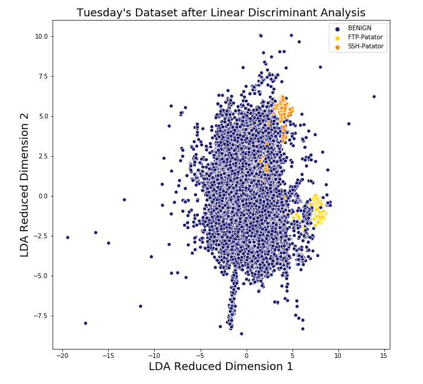
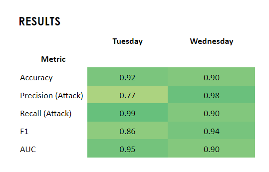
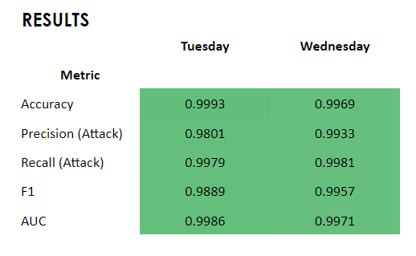

## Problem

Computer networks are constantly subjected to attacks which can effectively cripple a business' ability to function. Cyber attacks are hard to detect but are also costly to miss. The average cost of a single cyber attack on an enterprise network was estimated to be $1.3M in 2017.

#### Short video on the Human Cost of Cyberattacks:

## Dataset 

This project uses anomaly detection, in particular novelty detection, to alert network administrators and security experts when a network is potentially under attack. The dataset used is the Canadian Institute of Cybersecurity Intrusion Detection Evaluation Dataset (CICID S2017).

The dataset represents 3 days worth of network traffic activity, 2 days of which included the following cyber attacks: Brute Force, Denial of Service (DoS), Distributed Denial of Service (DDoS).

## Methodology

The detection of cyber attacks without using labeled data is a challenging problem. While the dataset used for this project is making use of labels for validation of results, in the real world labeled data has two main drawbacks: (i) labeled data is not readily generated by computer networks and (ii) manually labeling large amounts of network traffic data is very costly and time consuming.

Therefore, I set out the investigate if cyber attacks can be detected using anomaly detection techniques. Two catgeories anomaly detection methods were implemented for this project:

1. Outlier Detection
 * Robust Covariance
 * Isolation Forest
 * **One-class SVM** (best performing)
 * Local Outlier Factor
  
2. Novelty Detection
 * Robust Covariance
 * Isolation Forest
 * **Local Outlier Factor** (best performing)
 
Outlier detection methods work under the hypothesis that cyber attacks are vastly different than regular network traffic flow and thus will be present as outlier in the dataset. This is a fully unsupervised approach. Out of the 4 algorithms implemented (see notebooks [6a_Anomaly_Detection_Training](https://github.com/emirka/insight/blob/master/notebooks/6a_Anomaly_Detection_Training.ipynb) and [7a_Anomaly_Detection_Predict](https://github.com/emirka/insight/blob/master/notebooks/7a_Anomaly_Detection_Predict.ipynb) for implementation details), One-class SVM gave the best performance, which are provided below. However, the results are less than impressive.

This led to further investigation of the dataset to understand why outlier detection performance was poor. Therefore, I have implemented a dimensionality reduction of the dataset using Linear Disriminant Analysis (LDA) to better understand the nature of the cyber attacks in the dataset. (See [3_Dimensionality Reduction](https://github.com/emirka/insight/blob/master/notebooks/3_Dimensionality%20Reduction.ipynb) for implementation details)

Below is the result of the LDA transform for Tuesday's network traffic. Two things immediately stand out (i) the attacks are not outliers and (ii) the attacks are clustered together and don't mix too much with normal traffic (except for a few deeply embedded points).

The LDA investigation indicated that novelty detection, a semi-supervised learning technique, might be better suited for the task of anomaly detection in this dataset. The basic working mechanism of novelty detection is that the model is first trained on a "normal" dataset to learn the high and low density regions in the feature space. Then, the detection of anomalies happens as new datapoints appear in regions of low density, indicating a new and therefore "novel" behavior not previously encountered under "normal conditions"

Among the novelty detection methods implemented (see [8_Novelty_Detection](https://github.com/emirka/insight/blob/master/notebooks/8_Novelty_Detection.ipynb) for their implementation), Local Outlier Factor gave the best results which are provided below:

To verify the performance of novelty detection, a supervised classifier (XGBoost) was also trained on the dataset. See the notebook [4a_XGBoost_AllDays](https://github.com/emirka/insight/blob/master/notebooks/4a_XGBoost_All_Days.ipynb) for detailed documentation. Below are the high level results of the XGBoost algorithm, indicating that the performance of novelty detection is not vastly different than a supervised algorithm making full use of the labeled data:

## Front End

The project has a working webapp that can be used as a dashboard to visualize anomalies in the network traffic.

For working webapp is named "dashboard.ipynb" under ./webapp directory. Please see the notebook [8_Novelty_Detection](https://github.com/emirka/insight/blob/master/notebooks/8_Novelty_Detection.ipynb) for a detailed notebook explaining the code in the webapp (excluding training procedure).

The webapp by default uses the saved predictions to visualize. You can also predict on a dataset of your choosing but models files have been excluded due to their size. If you would like to train your models from scratch (can be very time consuming) simple run the training procedure detailed in the Jupyter notebook "8-Novelty Detection".

To run the webapp you need to enter the following command on your terminal

    voila dashboard.ipynb
    
To work this webapp needs to have Voila, ipywidgets and plotly installed upon a standard Anaconda installation.

You can install them using:

    pip install voila
    pip install ipywidgets
    pip install plotly"
    
You can also find the full environment in the _requirements.txt_ file under the root directory. You can clone a virtual conda environment using the following command (change _myenv_ to desired environment name):

    conda create --name myenv --file requirements.txt

You can find a hosted version of the webapp [here](http://flagit.live:8866/). Below is a screenshot of the webapp dashboard.

